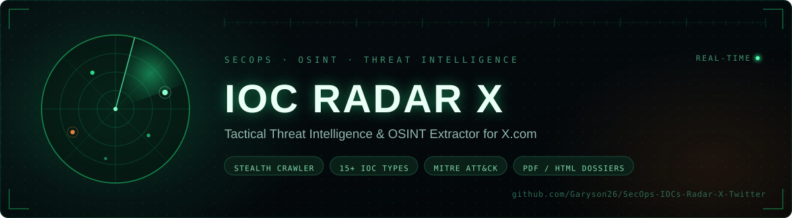

  
  
  
  
  

# ⚡ SecOps IOC Radar X [Twitter]

**Tactical Threat Intelligence & OSINT Extractor**

**SecOps IOC Radar X** is a high-performance, stealthy OSINT tool designed to scrape, extract, and analyze Indicators of Compromise (IOCs) strictly from X.com (Twitter). It leverages headless browser automation to monitor threat actors, security researchers, and malware campaigns in real-time.

## 🌟 Key Features

- **Stealth Crawler:** Utilizes Playwright with advanced evasion techniques to scrape X.com without raising alarms.
- **Smart IOC Extraction:** Automatically identifies, extracts, and defangs 15+ IOC types (IPv4/v6, Domains, URLs, Hashes, Wallets, CVEs, etc.).
- **Threat Context Correlation:** Employs rule-based risk scoring and MITRE ATT&CK mapping based on the text context surrounding the IOCs.
- **Secure Session Handling:** Encrypts imported X.com session cookies ensuring your authentication tokens are stored securely.
- **Export & Reporting:** Generate beautiful PDF and HTML threat intelligence dossiers on the fly, ready for distribution.
- **Sleek Web Interface:** Provides a beautiful, tactical, dark-themed UI built for security analysts.

## 🚀 Getting Started

For full instructions, please see the dedicated documentation files:

- [Installation Guide](INSTALL.md)
- [Usage Guide](USAGE.md)
- [Contributing](CONTRIBUTING.md)

## 🛡️ Legal & Disclaimer

IOC Radar X is built for educational and defensive threat intelligence purposes only. Crawling social media platforms may violate their Terms of Service. The maintainers are not responsible for any misuse, account bans, or damages caused by the use of this tool. Use responsibly and respect rate limits.
